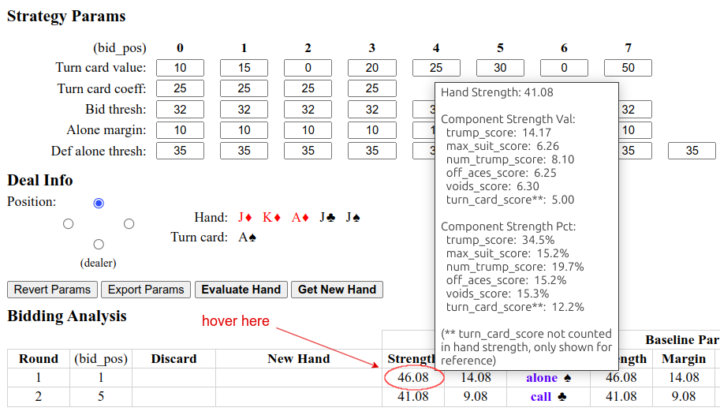
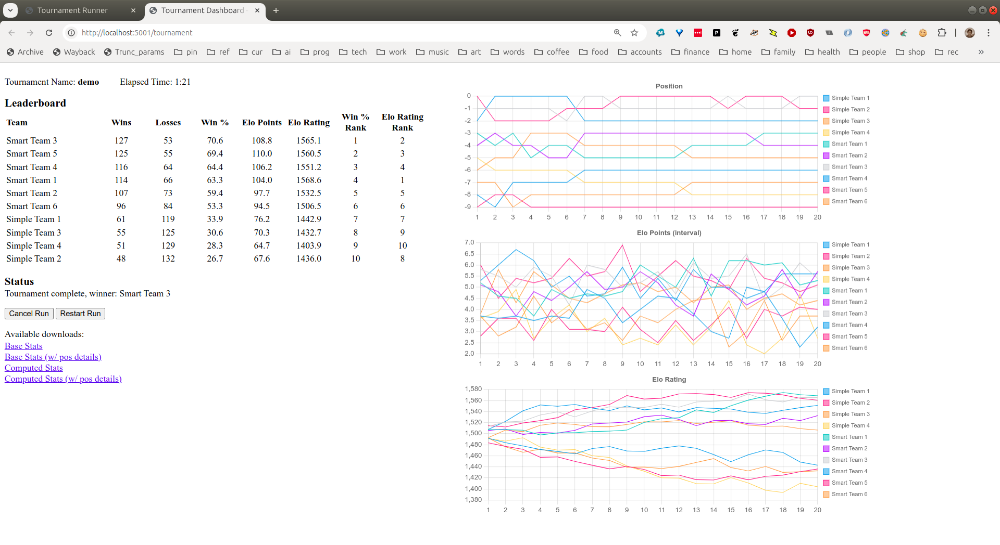

# Apps

This module contains various applications that either support or provide friendlier access
to the `euchre-plt` underlying functionality.

## Smart Tuner

Simple form-based web app to evaluate bidding strategies for `StrategySmart`—useful
for manually testing/tweaking the various parameters, coefficients, and thresholds.

### Setup

Only need to do this one time (to install Flask components):

```bash
$ cd apps
$ pip install -r requirements.txt
```

### Start the server

For local usage:

```bash
$ python -m apps.smart_tuner
```

or:

```
$ flask --app apps.smart_tuner run [--debug]
```

Note that `--app smart_tuner` (no parent module) should be specified if running from the
`apps/` subdirectory.

### Run the application

Open a browser window and navigate to `localhost:5000`.  The usage of the application
should be pretty self-explanatory.

**Hint 1**: hover over "Strength" value in the Bidding Analysis section to get a detailed
breakdown of the contribution from the various components scores; for example:

<p align="center">
  
</p>

**Hint 2**: click on individual cards in the Deal Info section (either "Hand" or "Turn
card") to change to a different card (bidding analysis will be updated automatically).
This feature can be used to examine/explore specific deal scenarios.

## YAML Generator

Module (and command line tool) for generating nice looking YAML from a data structure
(i.e. dict or list).  More flexible than `yaml.dumps()` in the `pyyaml` package.

### Command line tool

Reformat a json or yaml file (or stream) as nice looking YAML.

Usage:

```bash
$ python -m apps.to_yaml <filename> [<arg>=<value> ...]
```

where: '-' for *\<filename>* indicates stdin.

Supports the following keyword args:

- `indent` - level of indentation between levels (default = 2)
- `offset` - offset for the entire output, e.g. representing the interior of a
  document body (default = 0)
- `maxsize` - max number of items for single- vs. multi-line representations of
  lists of dicts (default = 10)
- `maxline` - max line length for single- vs. multi-line representations of lists or
  dicts (default = 90)
- `padding` - minimum padding between key name + colon and corresponding value for
  associative arrays (i.e. dicts, in python) (default = 2)

### As a library

Usage:

```python
from apps.to_yaml import to_yaml

data_yaml = to_yaml(data, indent=2, offset=4)
```

Keyword arguments for `to_yaml()` are same as for command line tool (see above).

Supported types in the input data include: `list`, `dict`, and scalars (`str`,
`Number`, `bool`, `NoneType`, or anything else where `repr()` yields a valid
YAML representation).

The full interface is documented at [module-apps.to_yaml](https://crashka.github.io/euchre-plt/_build/html/apps.html#module-apps.to_yaml).

## Tournament Runner

Simple form-based web app to run tournaments.

### Setup

Same as for Smart Tuner [Setup](#setup), above.

### Start the server

For local usage:

```bash
$ python -m apps.tournament_runner
```

or:

```bash
$ flask --app apps.tournament_runner run [--debug]
```

Note that `--app tournament_runner` (no parent module) should be specified if running
from the `apps/` subdirectory.

### Run the application

Open a browser window and navigate to `localhost:5000`.  The usage of the application
should be pretty self-explanatory.

Here is a sample dashboard result after running the `"demo"` tournament (configured in
`config/tournaments.yml`):

<p align="center">
  
</p>
